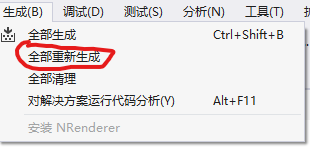
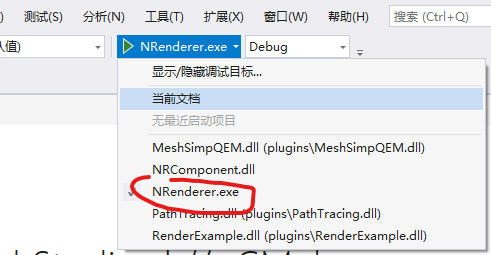

NKU 计算机图形学2024Spring大作业
---

# 环境配置

+ 操作系统: `Windows 10`
+ 编译器: `MSVC(Visual Studio 2019)`
+ `Opengl 3.3` 以上
+ `CMake 3.18`以上

# 编译说明

1. 打开`./code`所在文件夹->右键->使用`Visual Studio`打开
2. 项目->生成CMake缓存

    
3. 生成->全部重新生成

    
4. 选择启动项

    

# 新增内容

#### 添加了对金属材质和电介质材质的支持

#### 实现了光子映射和路径追踪混合渲染算法

#### 实现了漫反射的半球余弦采样和光源的重要性采样

#### 实现了环境映射光源

#### 实现了KD树加速光子映射的密度估计

